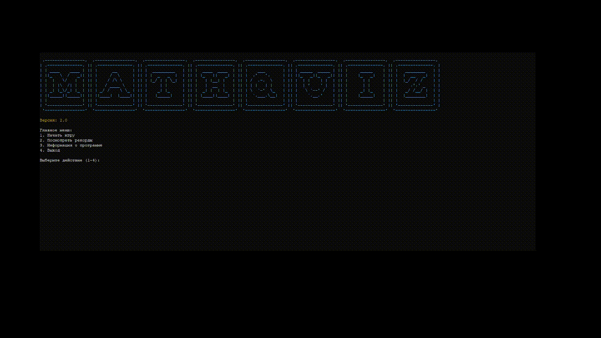

# 🧮 MathQuiz


> Интерактивная математическая викторина с богатым функционалом для развития математических навыков

<div align="center">
  
</div>

## 📋 Содержание

- [Особенности](#-особенности)
- [Установка](#-установка)
- [Использование](#-использование)
- [Режимы игры](#-режимы-игры)
- [Типы задач](#-типы-задач)
- [Управление](#-управление)
- [Разработка](#-разработка)
- [Лицензия](#-лицензия)

## ✨ Особенности

### 🎮 Игровые режимы
- **Стандартный режим** - соревнуйтесь со временем
- **Режим практики** - учитесь в своем темпе

### 📚 Разнообразие задач
- **Арифметика** - от простого сложения до извлечения корней
- **Уравнения** - линейные уравнения с переменными
- **Текстовые задачи** - реальные жизненные ситуации
- **Последовательности** - прогрессии и закономерности
- **Геометрия** - площади и периметры фигур

### 🎯 Уровни сложности
| Уровень | Диапазон чисел | Время | Операции |
|---------|----------------|-------|-----------|
| Легкий | 1-10 | 60 сек | +, -, * |
| Средний | 1-50 | 90 сек | +, -, *, ** |
| Сложный | 1-100 | 120 сек | +, -, *, **, √ |

### 🌟 Дополнительно
- 🏆 Таблица рекордов
- 🔥 Система streak
- 📊 Детальная статистика
- 🎨 Красочный интерфейс
- 💾 Сохранение прогресса

## 🚀 Установка

1. Клонируйте репозиторий:
```bash
git clone https://github.com/your-username/math-quiz.git
cd math-quiz
```

2. Создайте виртуальное окружение:
```bash
python -m venv venv
source venv/bin/activate  # Linux/Mac
venv\Scripts\activate     # Windows
```

3. Установите зависимости:
```bash
pip install -r requirements.txt
```

## 🎮 Использование

1. Запустите приложение:
```bash
python math_quiz.py
```

2. В главном меню выберите:
- 1️⃣ Начать игру
- 2️⃣ Посмотреть рекорды
- 3️⃣ Информация о программе
- 4️⃣ Выход

## 🎲 Режимы игры

### Стандартный режим
- ⏱️ Ограниченное время
- 📈 Таблица рекордов
- 🏆 Сохранение результатов

### Режим практики
- 🎓 Без ограничения времени
- 📚 Фокус на обучении
- 🔄 Неограниченные попытки

## 📝 Типы задач

### 🔢 Арифметические примеры
```
2 + 3 = ?
5 * 4 = ?
2 ^ 3 = ?
√16 = ?
```

### ➗ Уравнения
```
2x + 5 = 13
3x - 7 = 14
```

### 📖 Текстовые задачи
```
В магазине было 50 яблок. 
30 яблок продали. 
Сколько яблок осталось?
```

### 📈 Последовательности
```
2, 4, 6, 8, ... (следующее число?)
1, 2, 4, 8, ... (следующее число?)
```

### 📐 Геометрия
```
Площадь прямоугольника со сторонами 5 и 3?
Периметр квадрата со стороной 4?
```

## ⌨️ Управление

- `Enter` - Подтвердить ввод
- `1-4` - Выбор пункта меню
- `.` - Разделитель для дробных чисел

## 🛠️ Разработка

### Зависимости
- `colorama` - цветной текст
- `art` - ASCII-арт

### Структура проекта
```
math-quiz/
├── math_quiz.py
├── requirements.txt
├── README.md
├── LICENSE
└── high_scores.json
```

## 📄 Лицензия

Проект распространяется под лицензией MIT. Подробности в файле [LICENSE](LICENSE). 

## 📞 Поддержка

Если у вас возникли вопросы или проблемы:
- Напишите в Telegram: @MrMeowMurk

---

<div align="center">
Сделано с ❤️ by MeowMurk
</div>